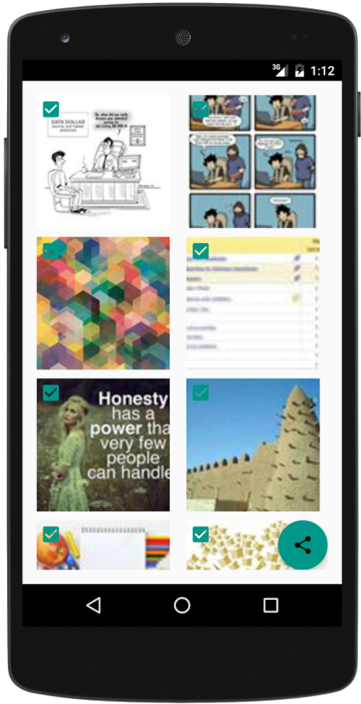
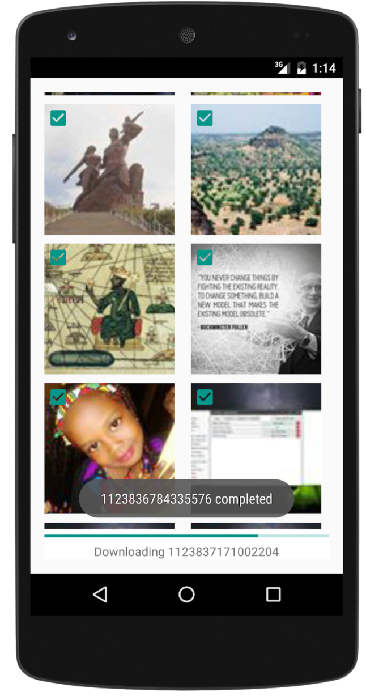
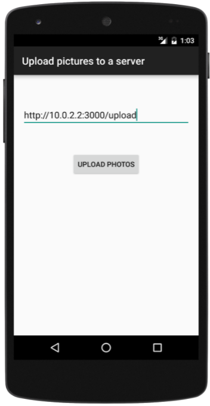
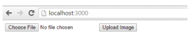

PhotoLoader
===========

# Building a mini Facebook photos exporting app

## Features

- Sign in the user using Facebook (make sure to ask for permission to access his facebook albums and photos)

- Albums should be displayed as Grid list of albums (2 albums per row). The albums should be sorted by name. 

- Once the user taps on any album, we load the photos in the selected album and allows the user to choose one or many photos (check-mark on selected pictures). Result should be paginated. User confirms when he finishes.

- Selected pictures are downloaded and sent to a backend server for storage (if you are comfortable with Amazon S3 you can avoid wasting time by skipping the download part and send directly to S3). A progress bar is displayed based on the real progress state.

- Once all photos are uploaded, show a confirmation message centered on a white screen.

## Solution

### Frontend : Android App
GitHub https://github.com/HalidCisse/PhotoLoader
Dev Tool Android Studio 2.0 

### Libraries used
- Facebook Android Sdk
Used to access/ pull data (Login, images, albums) from facebook CDN
Github https://github.com/facebook/facebook-android-sdk

- Ion
Used for Handling asynchronous photo uploads to the node server and also loading images from Facebook Graph to imageViews, including image caching
GitHub https://github.com/koush/ion

- ThinDownloadManager 
Used for Handling pictures download from Facebook Graph 
GitHub https://github.com/smanikandan14/ThinDownloadManager

- Backend : Node Js
Handles uploads from the android app, and save it to the /uploads directory
You can also upload files directly from a browser
GitHub https://github.com/HalidCisse/NodeServer

- Dev Tool PHPStorm
- Multer
Used for photo upload handling
Github https://github.com/expressjs/multer

## Interface

